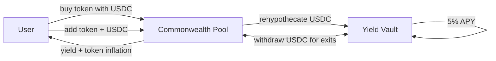

# Commonwealth – Yield-Bearing LP Token Protocol

## Concept

Commonwealth is a token protocol where the token is a **common good** of all participants. Users buy the token with USDC, then provide liquidity into a **Token : USDC** pool. The protocol rehypothecates all USDC into yield vaults (e.g. **Spark / Sky**) and redistributes yield back to liquidity providers.

The goal: a protocol that is **attractive to users** (everyone earns yield) and **sustainable** (the commonwealth generates returns). The best outcome is one where the fewest users lose money.

---

## User Journey

1. User buys tokens with USDC
2. USDC enters the commonwealth (deposited into yield-bearing vault)
3. User adds liquidity (token + USDC pair) to participate in yield
4. USDC from liquidity is also deposited into the vault
5. Vault generates yield (e.g. 5% APY)
6. Yield is distributed to liquidity providers proportionally
7. User can remove liquidity and sell tokens at any time

---

## Yield Sources

A liquidity provider is exposed to three sources of yield:

1. **Buy USDC yield** – yield on USDC spent to buy tokens
2. **LP USDC yield** – yield on USDC provided as liquidity
3. **Token inflation** – new tokens minted proportional to tokens provided as liquidity

**Only paired liquidity (token + USDC) entitles the provider to yield.** Holding tokens alone does not earn yield.

---

## Core Economic Loop



---

## Protocol Fee

- All USDC is deposited into yield vaults generating 5% APY
- The commonwealth may take a percentage of generated yield as its cut
- Protocol fee is configurable per model (starting at 0% for testing)

---

## This Is a Testfield

The `sim/` directory contains Python models that simulate the protocol under various configurations. The purpose is to **validate math and choose the correct model** before writing Solidity contracts.

Each model is defined by its **bonding curve type**:
- **Constant Product** (CYN), **Exponential** (EYN), **Sigmoid** (SYN), **Logarithmic** (LYN), **Polynomial** (P15YN, P20YN, P25YN)

Fixed invariants across all models:
- **Yield → Price = Yes** — vault compounding grows token price
- **LP → Price = No** — adding/removing liquidity is price-neutral
- **Token Inflation = Yes** — LPs receive minted tokens as yield

See [MODELS.md](sim/MODELS.md) for the full model matrix and [MATH.md](sim/MATH.md) for bonding curve formulas and analysis.

---

## How to Run

```bash
# Run comparison table (all 7 active models × all scenarios)
./run_sim.sh

# Run a specific model
./run_sim.sh CYN

# Run specific scenario
./run_sim.sh --whale CYN
./run_sim.sh --bank
./run_sim.sh --rwhale           # Reverse whale (whale exits first)
./run_sim.sh --stochastic       # Stochastic arrivals (seeded RNG)

# Run full test suite (434 tests, 7 modules)
python3 -m sim.test.run_all
```

---

## References

- **Rehypothecation** – deploying deposited capital into yield vaults
- **Bonding Curves** – Bancor, Uniswap v2, Curve Finance
- **Yield Vaults** – Spark (Sky/MakerDAO ecosystem)
